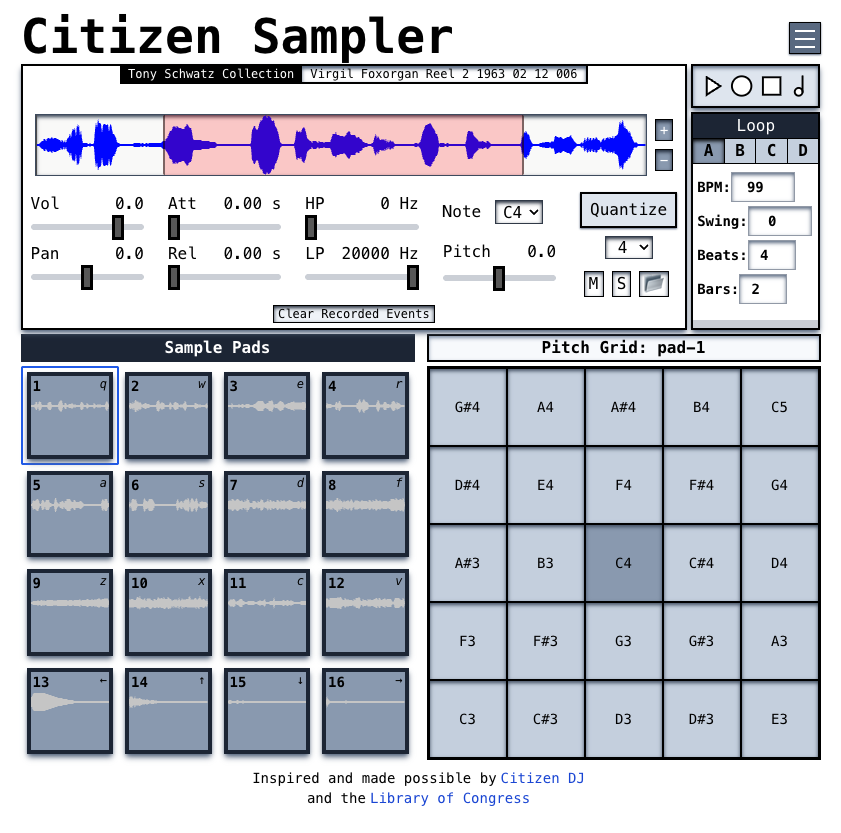

# Citizen Sampler



See it live: https://citizensampler.com

**Citizen Sampler** is an MPC-style web instrument inspired by—and made possible by—the [Citizen DJ project](https://citizen-dj.labs.loc.gov/) at the Library of Congress.

As a musician, when I came across Citizen DJ, I was immediately excited by the expansive catalog of public-domain audio samples and inspired by the creative potential of combining them in new and unique ways. While Citizen DJ provides a sequencer for programming audio playback by beat subdivision, I wanted to build something playable like a real-time instrument.

Early in building Citizen Sampler, I discovered [Tone.js](https://tonejs.dev/), a powerful library built on the Web Audio API. It provided a rich set of tools for creating playable interfaces and scheduling audio playback. All sample pads on the page are linked to a custom sampler, forked from Tone's built-in Sampler instrument, to allow offset of the samples start position. Tone.js is also used for managing effects nodes per sampler, loop settings, and recording/playback scheduling of recorded events.

## Audio Sources

There are two main categories of audio samples:

1. **Public Domain Samples**  
   Samples curated by the Citizen DJ project and accessed from the Library of Congress are in the public domain.

2. **Drum Kit Samples**  
   The kit samples (identical to those on Citizen DJ’s Remix page) were generated from drum kits provided by Slackermedia Multimedia Sprint v2. These are available under a [Creative Commons Attribution-ShareAlike 3.0 license](https://creativecommons.org/licenses/by-sa/3.0/us/).  
   The processed audio files used by Citizen DJ can be downloaded from [GitHub](https://github.com/LibraryOfCongress/citizen-dj/tree/master/audio/drum_machines) and are available under a [Creative Commons Attribution-ShareAlike 4.0 International license](https://creativecommons.org/licenses/by-sa/4.0/).

## Playing Citizen Sampler

### Sample Pads

The sample pads are the core of Citizen Sampler. The most recently triggered pad will display its settings in the **Sample Settings** section, and the **Pitch Grid** will become active for re-pitched playback.  
By default:

- **Pads 1–12**: Loaded with samples from the Library of Congress
- **Pads 13–16**: Loaded with samples from a selected drum machine

Each pad can be reassigned to any sample category. You can trigger pads by click/touch or use the keyboard hotkey shown in the pad’s top-right corner.

### Pitch Grid

Play and record the selected sample at various pitches—an octave up or down from its base note—in semitone steps.

### Sample Settings

This section shows a zoomable waveform where lets you define playback start and end points.

Zooming:

- **Quick Zoom**: `Ctrl + scroll`
- **Precise Zoom**: `+` and `–` buttons

Additionally in this window you can adjust the following settings:

- Volume, pan, attack, release
- Filter settings: high-pass, low-pass
- Base note and pitch offset
- Quantization on/off and subdivision level
- Mute or solo
- Load a new sample

### Transport Controls

Includes:

- **Play** - `Spacebar` - This will start the loop
- **Record** - `Ctrl + R` - If the loop has not already been started, Record will start the loop immediedly and all samples played on the Sample Pads or Pitch Grid will be recorded to the current loop. Turning record off will not stop the loop.
- **Stop** - `Spacebar` - Stop the loop
- **Metronome** - `M` - Toggle metronome

### Loop Section

Each of the four loop patterns (A, B, C, D) can have unique settings:

- **BPM**: Tempo in beats per minute
- **Swing**: Increasing this value shifts eighth notes toward the next beat
- **Beats**: Beats per measure
- **Bars**: Number of measures

**Note**: Adjustments cannot be made to loop settings while the loop is playing.

### Main Menu

- **Login / Signup:** Anyone can build beats and download WAV stems without logging in, but to save songs persistently to the database, users must create an account—either with a username/password or by signing in with Google.

- **Load Collection:** Choose from sample collections curated by Citizen DJ. The selected collection will replace the current samples on pads 1–12.

- **Load Kit:** Choose from eight different drum machines. Pads 13–16 will be replaced with a kick, snare, hi-hat, and rimshot sample from the selected kit.

- **Download Stems:** Export one audio file for each drum pad with existing recorded play events—organized per loop—to the user’s default download location.

# Developers

## Tech Stack & Structure

This is a monorepo project built with:

- TypeScript across both frontend and backend
- React / Next.js for the frontend
- Node.js / Express for the backend
- MongoDB with Mongoose for data persistence
- Tone.js for audio synthesis and scheduling
- Wavesurfer.js for waveform imaging and interaction
- Tailwind CSS for styling

## Getting Started

### 1. Clone the Repository

```bash
git clone https://github.com/bhdoggett/citizen-sampler.git
cd citizen-sampler

```

### 2. Set Up the Backend

```bash
cd backend
npm install
```

External accounts/resources required:

- Google OAuth Client (for login)
- Google Cloud Service Account
- Download the credentials JSON and convert it to a base64 string
- Google Drive folder
  - Store the drum machine samples (linked above) in a Drive folder and share it with your service account

Resend account for sending verification emails

Create a .env file in the backend directory:

```.env
NODE_ENV=development
BACKEND_BASE_URL=http://localhost:8000
FRONTEND_URL=http://localhost:3000
MONGO_URI=mongodb://localhost:27017
TOKEN_SECRET='your_token_secret_here'
EMAIL_TOKEN_SECRET='your_email_token_secret_here'
GOOGLE_CLIENT_ID='your_google_client_id_here'
GOOGLE_CLIENT_SECRET='your_google_client_secret_here'
RESEND_API_KEY='your_resend_api_key_here'
GOOGLE_APPLICATION_CREDENTIALS_BASE64='your_base64_encoded_credentials_json'
GOOGLE_DRIVE_DRUMS_FOLDER_ID='your_drive_folder_id_here'
```

- Start the backend development server:

```bash
npm run dev
```

### 3. Set Up the Frontend

```bash
cd ../frontend
npm install
```

- Create a .env.local file in the frontend directory:

```.env.local
NEXT_PUBLIC_API_BASE_URL=http://localhost:8000
```

- Start the frontend development server:

```bash
npm run dev
```

---

## License

- Code: [MIT License](./LICENSE)
- Drum kit samples: [CC BY-SA 4.0](https://creativecommons.org/licenses/by-sa/4.0/)
- Library of Congress samples: Public domain
